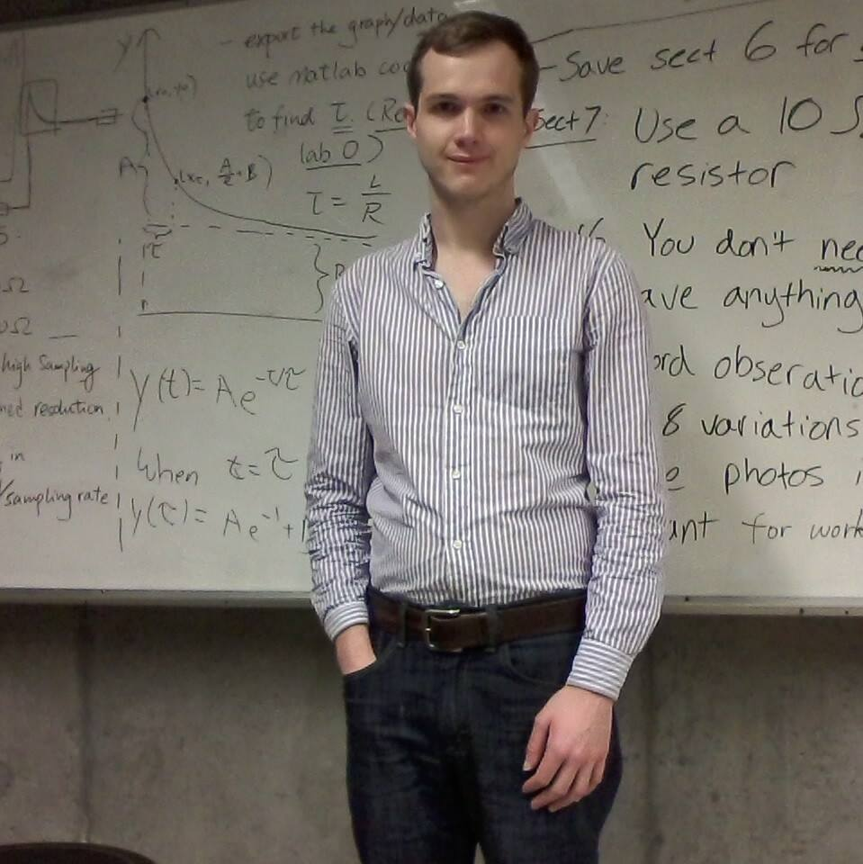

<!--  -->

# Daniel Breen
Ph.D. Student, Physics  
University of California, San Diego   
<em>Resume: </em><a href="/files/resume.pdf" target="_blank">PDF</a>  <small>(August, 2016)</small>  
<em>Email: </em><a href="mailto:dnlbreen@gmail.com">dnlbreen@gmail.com</a>  

I'm a physics PhD student at <em><a class="tosu" href="http://www.ucsd.edu/" target="_blank">UC San Diego</a></em> in the <a href="https://www-physics.ucsd.edu/fac_staff/fac_profile/faculty_description.php?person_id=1" target="_blank">Abarbanel</a> research group. I develop and apply a bayesian statistical method formulated as non-convex optimization to estimate parameters in nonlinear dynamical systems. I am interested in finding patterns in estimated parameters of neuron models that would be of biophysical and medical interest, using tools such as clustering and classification algorithms. I have been at the core of two collaborations applying my research group's tools to different biomedical applications. In one case, understanding the causes of Alzheimer's disease. In another, to characterize the dynamic behavior of a neuromorphic VLSI circuit that emulates membrane dynamics and channel kinetics. 

I have experience with python, R, and other packages commonly used in data mining. I enjoy discovering insights from data which can inform decision making. When I am not learning about science and technology, I like to run, swing dance, and play violin. I look forward to applying my technical skills in industry to create interesting and valuable products. 

<a href="http://doodle.com/dnlbreen" target="_blank">Meet me!</a>

 

