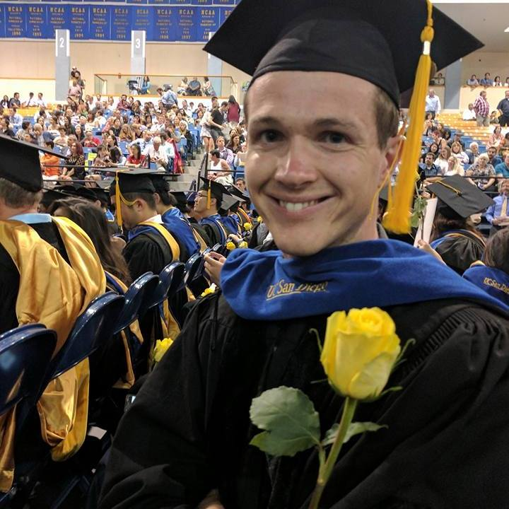

<!--  -->

<table width="275px;" border="0" align="right">
<tr>
<th scope="row"><right></right></th>
</tr>
<tr>
<th scope="row"><right></right></th>
</tr>
</table>

# Daniel Breen
Ph.D. Student, Physics  
University of California, San Diego   
<em>Resume: </em><a href="/files/resume.pdf" target="_blank">PDF</a>  <small>(August, 2016)</small>  
<em>Email: </em><a href="mailto:dlbreen@ucsd.edu">dlbreen@ucsd.edu</a> | <a href="mailto:dnlbreen@gmail.com">dnlbreen@gmail.com</a>  

I'm a physics PhD student at <em><a class="tosu" href="http://www.ucsd.edu/" target="_blank">UC San Diego</a></em> in the <a href="https://www-physics.ucsd.edu/fac_staff/fac_profile/faculty_description.php?person_id=1" target="_blank">Abarbanel</a> research group. In collaboration with research groups gathering experimental data, I use methods of statistical data assimilation to construct biophysically accurate models of neurons. Validated models can be used to infer properties of neurons and neural circuits that are ordinarily inaccessible or difficult to measure. 

<a href="http://doodle.com/dnlbreen" target="_blank">Meet me!</a>

 

